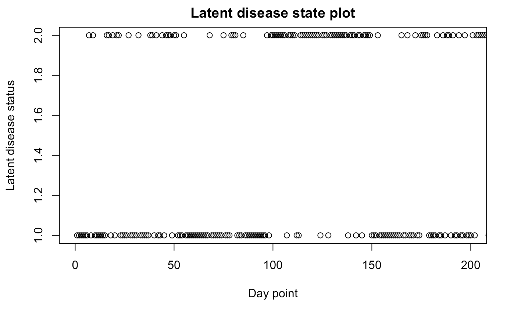

```{r setup, include=FALSE}
knitr::opts_chunk$set(echo = TRUE)
```

## Background

Schizophrenia (SCZ) is a severe mental disorder, which is a prevailing concern for more and more modern perople due to increasing number of patients. However, there is little physical symptoms related to Schizophrenia recognized by researchers so far, and it is not possible to measure biomarkers frequently when patients has been discharged, making prediction and diagnosis of Schizophrenia a challenging topic[@Suhara2017]. Without noticing these symptoms in the early stage, it may cause more death or damage to the lives of people. With that in mind, detecting Schizophrenia in advance is of top priority in order to take appropriate interventions for preventing critical situations.

During recent years, digital technology such as smart phones and wearable devices has developed rapidly, which contains multiple sensors to monitor the physiological signals, ambient environment, activity information and also some survey-based responses[@Torous2015]. This dramatically improvement of mobile devices brings us to sufficient and diverse real-time data of subjects off-hospital, which provides unprecedented opportunity for phychology research on prediction of mental health illness. This burst of different types of mental health related data makes it possible to use machine learning, such as Recurrent Nueral Network(RNN), to forecast disease status using data collected by digital devices. Its recursive formulation is suitable for handling time series naturally, and its paramters are uniform across all the time steps, which greatly reduce the computing cost of model training. In recent years, researchers are working hard to study how to improve the model performance of these machine learning method[@Sathyanarayana2016].

However, there also exists some challenges for the improvement of prediction ability, one of which is missing data existing in training dataset. Time series data often inevitably encounters with missing values in multiple situations, such as being lost to follow up, anomalies in physical condition, expense, inconvenience and so on. These missing values are deemed as informative missingness in that it may provide more information about the target[@RUBIN1976]. And there are many works have been done to deal with missing values in machine learning method, such as adding decay layers to LSTM model[@Che2018], adding missing indicators to predictors[@LiptonKW2016], and adding "Belief gate" to LSTM model[@Yeojin2018]. However, there is little research on whether missing pattern, such as missing completely at random, missing at random and missing not at random[@Little2002], can affect the prediction of machine learning performance so far. 

## Objective

This project aims to study the effect of missing values of different missing patterns on the LSTM model prediction performance under different conditions, such as ignoring missing data, imputation, or adjusting for missing data indicator. Furthermore, additional machine learning method will also be conducted in this project.

## Method

### Data Simulation

This project uses self-simulated data to train and test model performance. First we use the status-based model, Hidden Markov Model[@Zhang2010], to generate the dataset. We generate complete data without missing values that contains a true underlying association between the the latent disease status (social contacts) with input data and outcome (mental health score). Then simulated noncomplete datasets with different missingness patterns by deleting survey data points according to these three patterns.

#### Complete data generation

Specifically, there are mainly three types of data covered in this project:

+ **latent daily disease status: $Z_{ij}$**: daily unobserved clinical status ($nondisease=1$ or $disease=2$), which can have an relationship with the mobile data and survey data. $Z_{ij}$ represents the disease status at day point j for subject i, $i=1,...,N$, $j=1,...T$. We specify the matrix of time-homogeneous transition probabilities between latent states by setting:
\begin{itemize}
\item[a)] $$p(z_{it}=1|((z_{it-1}+z_{it-2}+z_{it-3})/3=1)), t=1,...,T$$ follows a truncated normal distribution $N_{[0,1]}(0.7,0.1)$
\item[b)] $$p(z_{it}=1|((z_{it-1}+z_{it-2}+z_{it-3})/3=2)), t=1,...,T$$ follows a truncated normal distribution $N_{[0,1]}(0.3,0.1)$
\item[c)] $$p(z_{it}=2|((z_{it-1}+z_{it-2}+z_{it-3})/3=1))=1-p(z_{it}=1|((z_{it-1}+z_{it-2}+z_{it-3})/3=1))$$
\item[d)] $$p(z_{it}=2|((z_{it-1}+z_{it-2}+z_{it-3})/3=2))=1-p(z_{it}=1|((z_{it-1}+z_{it-2}+z_{it-3})/3=2))$$
\end{itemize}

The latent disease status of day point $1 \sim 200$ for single patient can be seen from \text{Fig.1}

```{r, echo=FALSE, fig.cap="Latent disease status plot", out.width='70%',  fig.align = "center"}

```

+ **mobile data**: passive daily data collected through mobile app, including **call count** data **$x_1$**, **text count** data **$x_2$**, **duration** data **$x_3$**, etc. Call/text count data is zero-inflated and has an underlying Poisson distribution with mean proportional to the probability of latent disease; whereas duration is continuous data, whose mean also proportional to the probability of latent disease. 

The density plot for each variable can be seen from \text{Fig.2}

```{r, echo=FALSE, fig.cap="Density plot for each variable", out.width='100%',  fig.align = "center"}

```

+ **survey data**: active daily data collected through mobile app, has an underlying multinomial distribution; questions related to hallucinations are used as a proxy of clinical data to capture the latent episode. We assume that each survey outcome $k_{ij}$ indicates the meantal score derived by the summation of level of response of each subject i for each question in day point t; $k_{ijm}$ denotes the level of response for the kth question, where $m=1,...M$, M is the total number of questions. And:
\begin{itemize}
\item[a)] $p(k_{ijm}=2)$ follows a truncated normal distriburion $N_{[0,1]}(a*p(z_{ij}=2),0.05)$
\item[b)] $$p(k_{ijm}=1)=1-p(k_{ijm}=2)$$
\end{itemize}

The survey score for each latent status are shown in \text{Fig.3}, from which we can see that when the latent status is disease, the mean survey score is larger than that when the latent status is nondisease.

```{r, echo=FALSE, fig.cap="Plot of survey score distribution", out.width='70%',  fig.align = "center"}

```

#### Missing data generation

Generate response indicator, $R_{ij}$. $R_{ij}=1$ represents that the subject i in day point j reponsed to the survey, vice versa. For missing completely at random, we generate $R_{ij}$ by setting $p(R_{ij}=1) \sim N_{[0,1]}(0.6,0.1)$. As for missing at random, we let $R_{ij}$ be associated with some variables, such as text and call counts, and controlling the overall reponse rate falls around 0.6. When the missing pattern is missing not at random, we let $R_{ij}$ be associated with the survey score; $p(R_{ij}=1)$ will get smaller when survey score get higher, and the overall response rate is about 0.5. Finally replace the value of survey score as NA or missing for time point with $R_{ij}=0$.

### Model

LSTM is a special case of RNN, which relies on memory cells containing forget gate, input gate and output gate[@KANJO201946]. It has show significant performance on human activity prediction using mobile data[@7458136]. LSTM can bridge very long time lags by the constant error backpropagation within memory cells[@Hochreiter1997], making it possible to utilize previous information for the present mental status prediction[@7298966]. It is widely recognized that the mental disease in the previous time point may affect that in the present time point, so LSTM tends to outperform other traditional RNN models in prediction accuracy. What is more, the process of parameter tuning is simplified to a large extend, because it will automatically balance between multiple parameters such as learning rate, input gate and output gate bias. The process of feedforward in LSTM can be seen from the following functions[@DBLP:journals/corr/ChungGCB14]:

$$f_j^t=W_fx_j^t+U_fh_j^{t-1}+V_f\bigodot c_j^{t-1}+b_f \rightarrow \tilde{f}_j^t=\sigma_g(f_j^t) \tag{1}$$

$$i_j^t=W_ix_j^t+U_ih_j^{t-1}+V_i\bigodot c_j^{t-1}+b_i \rightarrow \tilde{i}_j^t=\sigma_g(i_j^t) \tag{2}$$

$$z_j^t=W_cx_j^t+U_ch_j^{t-1}+b_c \rightarrow \tilde{z}_j^t=\sigma_c(z_j^t) \tag{3}$$

$$c_j^t=\tilde{f}_j^t \bigodot c_j^{t-1}+\tilde{i}_j^{t} \bigodot \tilde{z}_{j}^t \rightarrow \tilde{c}_j^t=\sigma_h(c_j^t) \tag{4}$$

$$o_j^t=W_ox_j^t+U_oh_j^{t-1}+V_o \bigodot c_j^t) \rightarrow \tilde{o}_j^t=\sigma_g(o_j^t) \tag{5}$$

$$h_j^t=\tilde{o}_j^t \bigodot \tilde{c}_j^t \tag{6}$$

where $x_j^t \in R^{N\times1}$ is the j-th observation of an N-dimensional input vector at current time t, and in this project, $x_j^t$ is the j-th patients at day point t, with an 3-dimensional input vector, which are call/text counts and duration. $\{f_j^t,i_j^t,z_j^t,c_j^t,o_j^t,h_j^t\} \in R^{M \times1}$, $\{\tilde{f}_j^t,\tilde{i}_j^t,\tilde{z}_j^t,\tilde{c}_j^t,\tilde{o}_j^t,\tilde{h}_j^t \} \in R^{M \times1}$ are the j-th observation of forget gate, input gate, modulation gate, cell state, output gate, and hidden output at time t before and after activation. When the LSTM is one layer model, the network output is the hidden output, which means that the $\tilde{h}_j^t$ is the survey score of patients j. Moreover, $\{W_i,W_o,W_c,W_f\} \in R^{M\times N}$ and $\{ U_i,U_o,U_c,U_f\} \in R^{M\times N}$ are sets of connecting weights from input and recurrent, $\{ V_f, V_i, V_o \} \in R_{M \times 1}$ is the set of peephole connections from cell to gates, $\{b_i,b_o,b_f,b_c\} \in R^{M \times1}$ represents the corresponding biases of neurons, $\bigodot$ denotes element-wise multiplication, and $\sigma_g$, $\sigma_c$, $\sigma_h$ are nonlinear activation functions assigned for the gates, input modulation, and hidden output. The specific process of LSTM for our project can be seen from \text{Fig. 4}

```{r, echo=FALSE, fig.cap="Density plot for each variable", out.width='80%',  fig.align = "center"}

```

Apart from LSTM model, we will furthere explore additional RNN models, such as GRU model and GRU-D model[@Che2018] to extend the results. GRU model is a simplified version of LSTM model, which contains fewer parameters due to inabsent of output gate. The functions are as follows[@DBLP:journals/corr/ChungGCB14]: 

$$r_t=\sigma(W_rX_t+U_rh_{t-1}+b_r) \tag{7}$$
$$z_t=\sigma(W_zX_t+U_zh_{t-1}+b_z) \tag{8}$$
$$\tilde{h}_t=tanh(WX_t+U(r_t*h_{t-1})+b) \tag{9}$$
$$h_t=(1-z_t)*h_{t-1}+z_t*\tilde{h}_t \tag{10}$$
where matrices $W_r$, $W_z$, $W$, $U_z$,$U_r$, $U$, and vectors $b_z$, $b_r$. $b$ are model parameters.

GRU-D is a GRU model added by a decay mechanism for the input variables and the hidden states[@Che2018]. The functions are as following:

$$\gamma_t=exp \{ -max(0,W_{\gamma}\delta_t+b_{\gamma}) \} \tag{11}$$
$$\hat{x}_t^d=m_t^dx_t^d+(1-m_t^d)(\gamma_{x_t}^dx_{t'}^d+(1-\gamma_{x_t}^t)\tilde{x}^d) \tag{12}$$
$$\hat{h}_{t-1}=\gamma_{h_t}*h_{t-1} \tag{13}$$
$$r_t=\sigma(W_r\hat{x}_t+U_r\hat{h}_{t-1}+b_r) \tag{14}$$
$$z_t=\sigma(W_z\hat{x}_t+U_z\hat{h}_{t-1}+b_z) \tag{15}$$
$$\tilde{h}_t=tanh(W\hat{x}_t+U(r_t*\hat{h}_{t-1})+b) \tag{16}$$
$$h_t=(1-z_t)*\hat{h}_{t-1}+z_t*\tilde{h}_t \tag{17}$$

where $\gamma$ is vector of decay rate, $x_{t'}^d$ is the last observation of the d-th variable, $\tilde{x}^d$ is the empirical mean of the d-th variable.


### Method dealing with missing values

In order to get full use of missing values, researchers often first filling missing values and then trained these imputed dataset. This process needs additional models, time or data, and the quality of imputed data can not be guaranteed. The most common used method is to ignore missing values and get complete data analysis. Many researchers assumps that missing values has no effect to validity of outcome, so analysis is confined to samples with complete dataset[@6707014]. The second method is imputation. There are multiple ways to impute the missing values, such as mean, forward, simple, KNN[@Batista03astudy], MissForest[@101093], CubicSpline[@book], and MICE[@Azur2011]. Among these method, KNN can not impute missing values in time series with different length in that it takes each time step as one sample. In this project, we only focus simple imputation method such as mean, forward and MICE. The third method is to add missing indicators to original datasets. In clinical studies, missing values may carry rich information of patients status. By treating these artifacts as features, the realibility of outcome may be improved.[@LiptonKW2016]

## Reference
